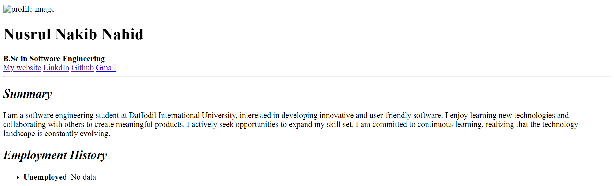
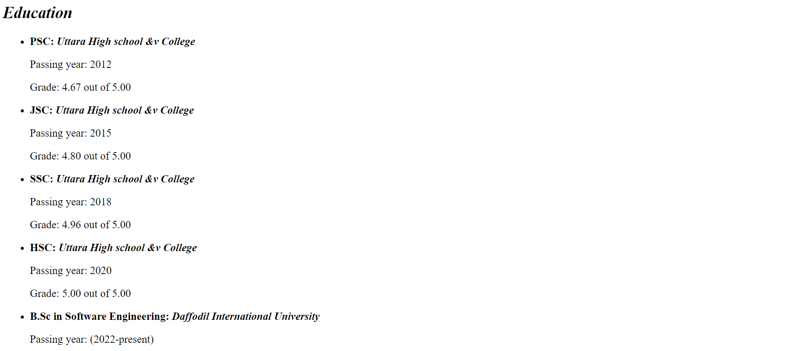
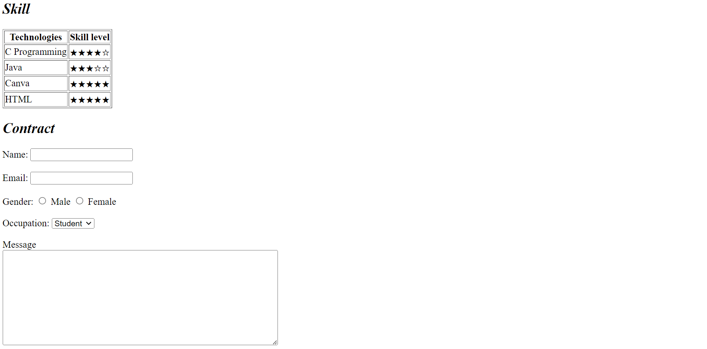
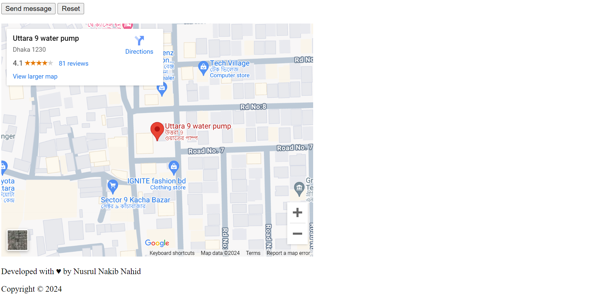

# HTML Resume Project

This is a simple HTML-based resume project created by Nusrul Nakib Nahid. The project displays personal information, education, skills, and includes a contact form. It is designed to be responsive and easy to navigate.

## Features

- Personal profile with name, title, and links to social media.
- Summary section showcasing career interests and goals.
- Education section detailing academic achievements.
- Skills section displaying technical proficiencies.
- Contact form for users to reach out.
- Embedded Google Maps iframe for location reference.
- Responsive design.

## Project Structure

- **Header:** Displays name, title, and social media links.
- **Summary:** Provides a brief career overview.
- **Employment History:** Placeholder section for employment records.
- **Education:** Lists academic history, including schools and grades.
- **Skills:** A table showing different technologies with skill levels.
- **Contact Form:** Allows users to send messages with fields like name, email, gender, and occupation.
- **Map:** An embedded Google Maps iframe showing a specific location.
- **Footer:** Copyright information and developer's name.

## Technologies Used

- **HTML5:** For creating the structure of the resume.
- **CSS:** Embedded in the HTML (optional to include separate styling).
- **Google Maps Embed:** For location visualization.
  
## Preview

You can view the live version of the resume [here](https://nusrulnakibnahid.github.io/My-Portfolio-Website/).

## How to Use

1. Clone or download the repository.
2. Navigate to the HTML file in your browser to view the resume.
3. Customize the resume by editing the HTML to suit your own information.

## Contributing

Feel free to contribute by suggesting improvements or adding new features. Fork the repository and submit a pull request with your changes.

## Contact

- **Email:** [nusrulnakibnahid.mail@gmail.com](mailto:nusrulnakibnahid.mail@gmail.com)
- **LinkedIn:** [Nusrul Nakib Nahid](https://www.linkedin.com/in/nakib-nahid/)
- **GitHub:** [nusrulnakibnahid](https://github.com/nusrulnakibnahid)

## Screenshorts

Here are some screenshots of the project:

*Description of Screenshot 1*

*Description of Screenshot 2*

*Description of Screenshot 3*

*Description of Screenshot 4*

